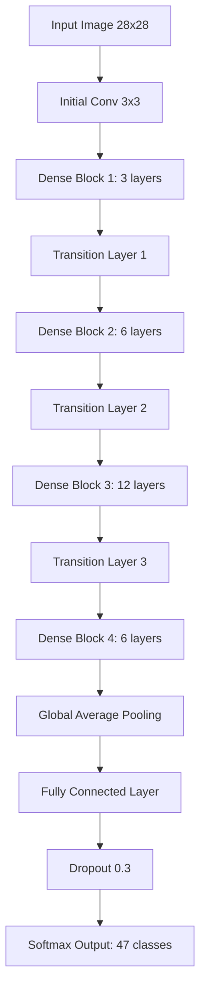

# 🧠 Extended MNIST Classification using Modified DenseNet
**[EMNIST 데이터셋 분류를 위한 경량화된 고성능 CNN 모델 프로젝트입니다]**  
DenseNet 구조를 효율적으로 수정하여 정확도와 추론 속도 사이의 최적의 균형을 찾고자 했습니다.
---
## 🛠 해결한 문제 (Problem Solving)
### 1. 기존 모델의 한계 극복: 정확도와 효율성의 트레이드오프
- **문제**: LeNet5는 속도는 빠르나 정확도(86.9%)가 낮았고, ResNet50은 정확도(90.4%)는 높지만 파라미터 수(23M)가 너무 많아 비효율적이었습니다.
- **사고**: 파라미터를 효율적으로 재사용하면서도 기울기 소실 문제를 해결할 수 있는 DenseNet의 특성에 주목했습니다.
- **해결**: Dense Block의 레이어 구성을 3-6-12-6으로 최적화하여 파라미터를 약 2.1M(ResNet50의 1/10 수준)으로 줄이면서도 정확도를 90.72%로 향상시켰습니다.
### 2. 학습 불안정성 및 소실되는 기울기 문제
- **문제**: 초기에 시도한 EfficientNetB1, VGG16 등은 EMNIST 데이터셋에서 학습이 불안정하거나 정확도가 낮게 측정되었습니다.
- **사고**: 작은 이미지(28x28) 특성상 특징 재사용(Feature Reuse)이 중요하다고 판단하여 DenseNet을 최종 베이스 모델로 선택했습니다.
- **해결**: ELU 활성화 함수와 Nesterov 옵티마이저를 적용하고, 전이 학습(Transfer Learning)을 활용해 학습의 안정성과 최종 성능을 확보했습니다.
---
## 💡 성장 및 향후 계획
- **배운 점**: 데이터셋의 특성에 맞는 적절한 아키텍처 선택이 성능에 미치는 결정적인 영향을 체감했습니다. 특히 하이퍼파라미터 튜닝과 특징 재사용 메커니즘의 중요성을 깊이 이해하게 되었습니다.
- **향후 계획**: 모델 압축 기법(Pruning, Quantization)을 추가 적용하여 극강의 효율성을 추구하고, 더 다양한 활성화 함수와 최신의 훈련 전략을 탐색할 예정입니다.
---
## 📊 성능 비교 (Results)
| Model | Parameters | Training Time | Test Accuracy |
| :--- | :--- | :--- | :--- |
| LeNet5 | 65,104 | 171.12s | 86.90% |
| ResNet50 | 23,684,015 | 1449.46s | 90.40% |
| **Our Model** | **2,152,667** | **1684.80s** | **90.72%** |

---
## 🛠 빌드 및 실행
1. 필요한 라이브러리를 설치합니다 (`requirements.txt` 또는 노트북 환경 구성).
2. 제공된 소스 코드를 실행하여 데이터셋을 로드하고 모델을 초기화합니다.
3. 분산 학습 환경(Distributed Training) 설정 후 학습을 진행하거나 학습된 가중치를 로드하여 평가를 수행합니다.
---
## ✨ 주요 기능 (Key Features)
- **고성능 분류**: EMNIST Balanced 데이터셋 기준 Top-1 정확도 90.72%, Top-5 정확도 99.80% 달성
- **모델 경량화**: ResNet50 대비 파라미터 수를 획기적으로 줄여(약 10% 수준) 효율적인 추론 가능
- **효율적 아키텍처**: Dense Block 구조 변경 및 전이 학습을 통한 최적의 성능 도출
- **빠른 추론 속도**: 전체 평가 시간 5.885초, 순수 추론 시간 5.361초의 빠른 응답성 확보
---
## 🛠 기술 스택 (Tech Stack)
- **Languages**: Python
- **Frameworks/Libs**: PyTorch/Keras (Distributed Training 활용)
- **Infra/Tools**: 4x NVIDIA A5000 24GB GPUs (Distributed Learning)
---
## 🏗 아키텍처 (Architecture)

